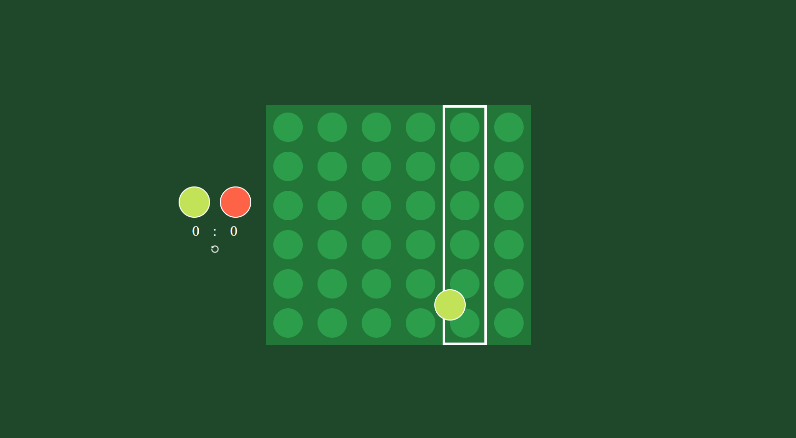
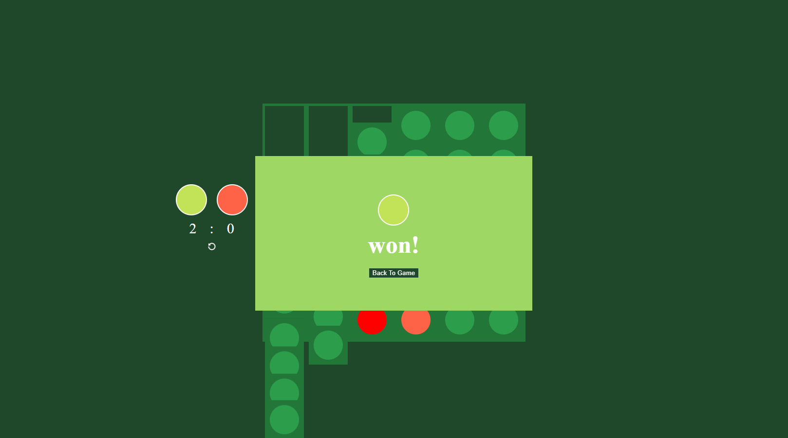

### Connect Four

Game for 2 players based on the board game. It was second project I've ever built and It was really exciting :)
http://connectfour2.herokuapp.com/register

---

### Logic

Whole logic game was built with Java Script and jQuery.

---

### Features

Game has a counter for both players. You can reset the game. Result of the game is stored in local storage so even after closing web window and opening it again you will see the result. Always in the end of the battle you can see cheesy animation where the game board is destroyed.

---

### Accessibility

You can play the game just using left/right arrow to move pointer and enter to admit chosen column.
